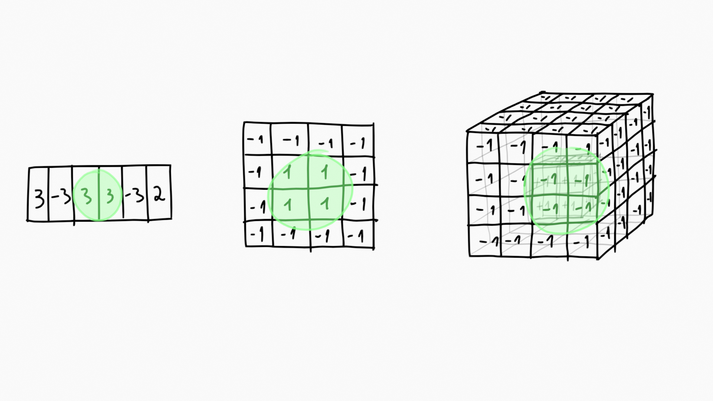

# Abstract
Given an **array of numbers**, the task of finding the subarray 
whose internal **sum is the greatest** is *trivial* when every 
number is  positive (the whole array is the largest).

This becomes less trivial when *negative* numbers are present, 
a brute force *combinatorial approach* runs in **quadratic time**.

The present *kadane approach* runs in **linear time**.

The algorithm can be extended to solve the problem in *more
than 1-dimensions* (ex. given a *matrix of numbers*, find the
sub-matrix whose internal sum is the greatest). These problems
have elevated temporal complexity which is unfeasable for
the *combinatorial approach*.
